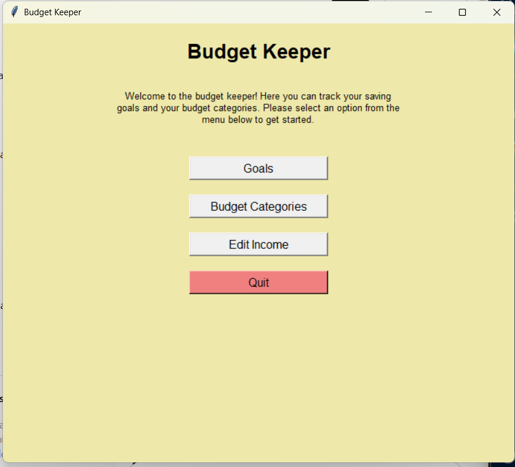

# Personal Finance  

***

This program is an expansive personal finance manager, with many tools and a clean GUI.  

## How to use the project 
*** 
1. install numpy and matplotlib, 
2. Hit play
3. Occasionally, some windows will appear behind others. Make sure to double check if a window "closes" unexpectedly

## List of Key Features
***
- Manages Budgets and Savings Goals
- Contains a currency conversion feture
- Visually displays budgetting
- Income and Expenses Manager
- Secure Login/Logout

## Contributors
***
- Valerie5801
- Zuzanune
- Pakistan5681
- CheesyDevil

## License Information
- Utah County Academy of Sciences

## Contributions
- You can make all of the windows more coherent and organize the code.